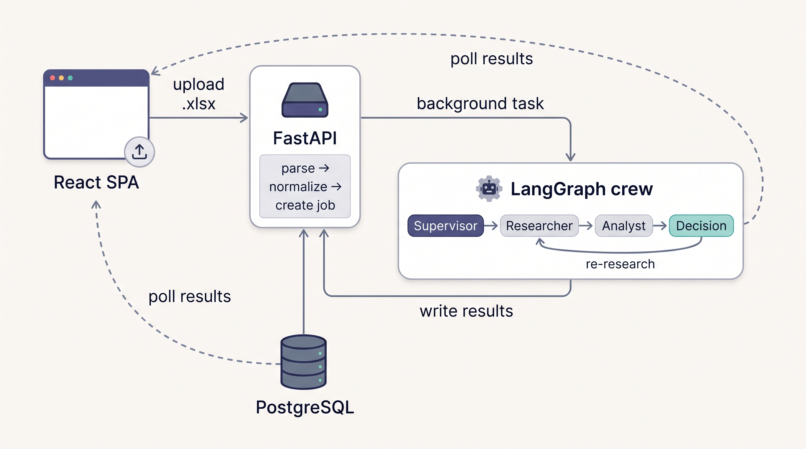
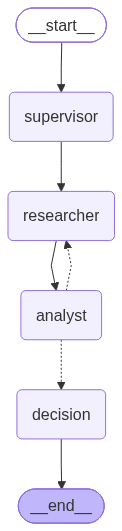

# Opportunity Analysis Engine

An AI-powered, full-stack application that automates the triage of public-procurement
opportunities (*appels d'offres*) for a fictional IT-services company (an **ESN**). A user uploads an Excel file of tenders; a **LangGraph** multi-agent crew researches and scores each one **0–100** against a defined business profile, issues a verdict — *Fort intérêt / À qualifier / Faible
intérêt / Non pertinent* — with a written justification and sources; and a **React** dashboard
shows the ranked results live.

This is a **personal project** of mine. It reimagines an earlier low-code prototype
(Power Apps + Power Automate) as a modern, self-hosted, agentic web app. The reasoning core is the centerpiece: a supervisor multi-agent graph with an explainable, weighted scoring rubric.

> **Note:** the scoring profile and its criteria (what makes a tender a good fit) are **entirely
> made up by me** for a generic, fictional IT-services company. They do not represent, and are not
> derived from, any real organization's data or criteria.

> **Stack:** React · FastAPI · LangGraph / LangChain · PostgreSQL — fully containerized with Docker.
> **Language:** UI in French, code and identifiers in English.

---

## Why I built this

**The goal of this project was to learn [LangGraph](https://langchain-ai.github.io/langgraph/) —
to understand, hands-on, how it works and where it actually helps.** The procurement-triage use
case is really a vehicle for that: it gave me a realistic problem messy enough to justify a
*multi-agent* design rather than a single prompt.

Along the way I wanted to answer, in code, questions like:
- **How do you model a stateful, multi-agent workflow?** — a `StateGraph` with a typed shared
  state passed between nodes (Supervisor → Researcher → Analyst → Decision).
- **How do agents loop and cooperate?** — the Analyst can flag gaps and send work *back* to the
  Researcher, a conditional cycle with a hard iteration guard so it always terminates.
- **What does LangGraph give you over hand-rolled orchestration?** — explicit graph structure,
  inspectable state, conditional edges, and a graph you can literally render as a diagram.
- **How does it compose with the rest of a real app?** — invoked per-opportunity from a FastAPI
  background job, with a pluggable LLM and a free offline scorer so the graph runs without a key.

So while it's a working full-stack app, its real purpose is a **learning artifact for LangGraph**
and agentic orchestration. Deployment is intentionally *not* part of this repo — the focus is the
reasoning core and how the pieces fit, not hosting. If you're here to see how LangGraph is used,
start with [The reasoning core (LangGraph)](#the-reasoning-core-langgraph).

---

## Table of contents
- [Why I built this](#why-i-built-this)
- [Features](#features)
- [Demo](#demo)
- [Architecture](#architecture)
- [The reasoning core (LangGraph)](#the-reasoning-core-langgraph)
- [Scoring rubric](#scoring-rubric)
- [Scorer modes: free vs LLM](#scorer-modes-free-vs-llm)
- [Tech stack](#tech-stack)
- [Getting started](#getting-started)
- [Configuration](#configuration)
- [Using the dashboard](#using-the-dashboard)
- [API reference](#api-reference)
- [Data model](#data-model)
- [Project structure](#project-structure)
- [Development](#development)
- [How it was built (6 phases)](#how-it-was-built-6-phases)
- [Known limitations](#known-limitations)
- [Possible improvements](#possible-improvements)

---

## Features
- **Excel upload** — drag-and-drop an `.xlsx` of opportunities; tolerant parser handles the real
  60-column procurement export (accented French headers, Excel serial dates), maps the relevant
  columns, and validates required ones.
- **Multi-agent scoring** — a LangGraph crew (Supervisor → Researcher → Analyst → Decision) with a
  bounded, gap-driven re-research loop.
- **Explainable results** — every verdict stores six weighted sub-scores, a rationale, detected
  domain/engagement, a recommended action, and the sources gathered during research.
- **Two scorer modes** — a **free, offline keyword/rules** scorer (default) and a **full LLM**
  crew, switchable with one env var.
- **Live dashboard** — asynchronous upload with a progress bar, a verdict-distribution chart, a
  ranked/sortable results table, and a detail drawer.
- **Filters & export** — filter by class, text search, Top N; export the (filtered) results to
  a formatted `.xlsx`.
- **History** — every analysis is persisted; reopen any past run with all its results.
- **Reproducible** — three containers, one `docker compose up`.

## Demo

<!-- Add the recording at docs/demo.gif and it renders here: -->
<!--  -->

Recording shot list (~15–20s), starting at http://localhost:5173:
1. **Upload** — drag `data/sample_opportunities.xlsx` onto the drop zone.
2. **Live progress** — the progress bar climbs as rows are scored.
3. **Results** — the verdict-distribution chart + ranked table appear.
4. **Filter** — click the *Fort intérêt* chip, then *Top 10*.
5. **Detail** — click a row to open the drawer (sub-scores, rationale, sources).
6. **Export & history** — click *Exporter Excel*, then open *Historique*.

## Architecture

Three services on one Docker Compose network:



**Separation of concerns:** React handles upload and presentation; FastAPI owns the workflow
(parse, loop, store) and the HTTP API; LangGraph is the reasoning brain; PostgreSQL is the single
source of truth. The reasoning graph is **stateless** — it is invoked per opportunity and holds no
durable state.

## The reasoning core (LangGraph)

The heart of the project is a `StateGraph` over a typed `OppState`. Each node is a function that
reads the shared state and returns only the keys it changes.



```
START → supervisor → researcher → analyst → (should_continue?) → decision → END
                          ▲__________________________|  "researcher"  (gaps remain & budget left)
                                                      |  "decision"    (otherwise)
```

| Node | Responsibility |
|---|---|
| **Supervisor** | Entry point; initializes the run and dispatches the crew. |
| **Researcher** | Uses a LangChain **DuckDuckGo** web-search tool to gather context on the client/sector, then an LLM condenses it into `research_notes` + `sources`. On a re-research pass it targets the reported `gaps`. |
| **Analyst** | The single authority on the numbers: produces the six sub-scores (structured output), the total, `gaps`, and detected domain/engagement. |
| **Decision** | Deterministically maps the score to an interest class + recommended action and writes the final rationale citing sources. It never re-scores. |

The **conditional edge** `should_continue` is what makes this a graph, not a pipeline: if the
Analyst reports `gaps` **and** `loop_count < MAX_LOOPS`, control loops back to the Researcher for a
targeted second pass; otherwise it proceeds to the Decision. `MAX_LOOPS` guarantees termination.

Every agent's prompt is a version-controlled file under `backend/app/prompts/` (prompts are
treated as source code).

## Scoring rubric

Scoring uses a **subtractive** method (start each criterion at zero, award points only on explicit
evidence, choose the lower band on doubt) with anti-uniformity rules — reproducing the tuned logic
of the original Power Platform tool. Total **100 points** across six criteria:

| Criterion | Max | Assesses |
|---|---:|---|
| **Alignement métier** | 30 | How clearly the requirement is core IT work (dev, data, AI, cloud, cyber, TMA, integration, consulting). |
| **Type d'engagement** | 20 | Service / assistance / TMA (high) vs. a licence or hardware sale (low). |
| **Organisme stratégique** | 15 | Ministry / CNSS / CDG / bank / major office = high; minor local body = low. |
| **Domaine techno prioritaire** | 15 | Explicit data / AI / cloud / cybersecurity = high; generic digital = mid. |
| **Faisabilité du délai** | 10 | Realism of the submission / delivery deadline. |
| **Conditions favorables** | 10 | Clear budget, reasonable caution/guarantee, etc. |

**Interest classes** (from the total): `75–100` **Fort intérêt** (→ Explorer) · `50–74`
**À qualifier** (→ Demander CDC) · `25–49` **Faible intérêt** (→ Surveiller) · `0–24`
**Non pertinent** (→ Ignorer). The rubric lives in `backend/app/config/rubric.py` as configuration.

## Scorer modes: free vs LLM

The Analyst is pluggable via the `SCORER` environment variable — both modes return the same
structured output, so the graph, database, and dashboard are identical either way.

| Mode | `SCORER` | How it scores | Cost | Notes |
|---|---|---|---|---|
| **Keyword** (default) | `keyword` | French lexicons for the four text criteria + numeric rules for deadline/budget/caution; graded per-criterion credit for realistic dispersion. | **Free, offline, instant** | Web-research step is skipped. Scores ~hundreds of rows in seconds. Lexicons in `keyword_scorer.py` are tunable. |
| **LLM** | `llm` | The full Gemini crew (Researcher → Analyst → re-research loop → Decision) using the subtractive prompt. | Uses the Gemini API | Richer, research-backed; subject to the model's rate limits. |

Use **keyword** for free bulk triage of the whole file, then **llm** on the shortlist for depth.

## Tech stack

| Layer | Technology | Why |
|---|---|---|
| Frontend | React (Vite) + Tailwind + Recharts | Drag-and-drop upload, live progress, dashboard, chart. |
| Backend / API | FastAPI (Python) | Owns the upload workflow + background job; auto OpenAPI docs. |
| Reasoning | LangGraph | Stateful multi-agent graph with a conditional re-research cycle. |
| Agent toolkit | LangChain | LLM wrappers, prompt templates, the web-search tool. |
| LLM | Google Gemini (`gemini-3.6-flash`), pluggable | Configured once, swappable without touching graph logic. |
| Web search | DuckDuckGo (`ddgs`) | Free, no API key. |
| Structured output | Pydantic | Guarantees the Analyst returns numeric sub-scores. |
| Persistence | PostgreSQL + SQLAlchemy | Single source of truth for jobs & results. |
| Excel | openpyxl | Parse uploads, build exports. |
| Packaging | Docker + Docker Compose | Reproducible three-service stack. |

## Getting started

**Prerequisites:** Docker Desktop running. (An LLM API key is only needed for `SCORER=llm`.)

```bash
# 1. Configure environment (defaults to the free keyword scorer)
cp backend/.env.example backend/.env

# 2. Build & start all three services
docker compose up -d --build

# 3. Open the dashboard
#    http://localhost:5173         (app)
#    http://localhost:8000/docs    (interactive API docs)
```

Upload `data/sample_opportunities.xlsx` (or your own export). Stop with `docker compose down`
(Postgres data persists in the `pgdata` volume).

## Configuration

All backend settings come from `backend/.env` (never committed; see `.env.example`):

| Variable | Default | Purpose |
|---|---|---|
| `SCORER` | `keyword` | `keyword` (free) or `llm` (Gemini crew). |
| `LLM_PROVIDER` | `google` | LLM provider factory (used only when `SCORER=llm`). |
| `GOOGLE_API_KEY` | — | Gemini key (free at aistudio.google.com); required for `llm` mode. |
| `GEMINI_MODEL` | `gemini-3.6-flash` | Gemini model id. |
| `MAX_LOOPS` | `2` | Max Researcher passes (re-research termination guard). |
| `SEARCH_MAX_RESULTS` | `4` | Web-search results per query. |
| `DATABASE_URL` | postgres… | SQLAlchemy connection (matches compose). |
| `CORS_ORIGINS` | localhost:5173,3000 | Allowed frontend origins. |

## Using the dashboard
1. **Nouvelle analyse** — drag-and-drop an `.xlsx`; the file is validated, parsed and de-duplicated.
2. **Progress** — a job is created and processed in the background; the progress bar and rows update live.
3. **Results** — a verdict-distribution chart + a synthesis card, and a ranked table
   (Rang · N° · Référence · Objet · Organisme · Ville · Budget · Caution · Score · Verdict).
4. **Filter / search / Top N** and **Exporter Excel** (respects the active filters).
5. **Detail drawer** — click a row for the six sub-scores, rationale, sources and recommended action.
6. **Historique** — reopen any past analysis.

## API reference

Base path: `/api/v1`

| Method | Endpoint | Description |
|---|---|---|
| `POST` | `/upload` | Multipart `.xlsx`. Parses, validates, de-duplicates, creates a job, starts the background scoring task. Returns `{ job_id, total_rows }`. Malformed files → `400`. |
| `GET` | `/results/{job_id}` | Job status, progress counts, and analyzed rows (ordered by score). |
| `GET` | `/results/{job_id}/export` | Download a formatted `.xlsx`. Optional filters: `?verdict=&search=&top=`. |
| `GET` | `/jobs` | All past analyses (for the history screen). |
| `GET` | `/health` | Health check. |

Interactive Swagger UI at `http://localhost:8000/docs`.

## Data model

**Excel input → normalized `Opportunity`** (extra columns ignored; required: id, reference, objet):

| Field | Excel column | Notes |
|---|---|---|
| `id` | Numéro d'ordre | numeric → stored as string |
| `reference` | Référence | |
| `title` / `description` | Objet | title is a truncation of Objet |
| `client` | Organisme | |
| `city` | Ville | |
| `budget` | Budget | free-text, often empty |
| `deposit` | Caution | bid guarantee |
| `deadline` | Date limite | Excel serial date → real date |

**PostgreSQL tables:**
- **`job`** — `id`, `filename`, `status` (pending/running/done/error), `total_rows`,
  `completed_rows`, `created_at`.
- **`result`** — the opportunity display fields (denormalized) + analysis: `score`,
  `subscores` (JSONB, six keys), `verdict`, `action`, `rationale`, `sources` (JSONB), `created_at`.

**Graph state (`OppState`)** — `opportunity`, `profile`, `research_notes`, `sources`, `subscores`,
`score`, `gaps`, `loop_count`, `verdict`, `action`, `rationale`, plus detected fields.

## Project structure

```
opportunity-analysis/
├─ docker-compose.yml          # frontend + backend + db
├─ DESIGN.md                   # dashboard design system (dark BI + verdict colors)
├─ data/                       # sample workbooks + LangGraph diagram
├─ backend/
│  ├─ Dockerfile, requirements.txt, .env.example
│  └─ app/
│     ├─ main.py               # FastAPI app (CORS, lifespan, /health)
│     ├─ llm.py                # pluggable LLM factory
│     ├─ config/               # settings, rubric, default profile
│     ├─ schemas/              # Pydantic: Opportunity, Profile, AnalystOutput
│     ├─ graph/                # OppState + opportunity_graph (+ Phase-1 minimal_graph)
│     ├─ agents/               # supervisor, researcher, analyst, decision
│     ├─ analysis/             # scoring (aggregate) + keyword_scorer
│     ├─ db/                   # SQLAlchemy base, models, crud helpers
│     ├─ api/                  # request/response schemas + routes
│     ├─ workflow/             # excel parse, excel export, background runner
│     ├─ prompts/              # versioned agent prompts (French)
│     └─ scripts/              # per-phase harnesses, seed_demo, make_sample_xlsx
└─ frontend/
   ├─ Dockerfile, package.json, tailwind.config.js, vite.config.js
   └─ src/
      ├─ App.jsx, api.js, verdict.js, index.css
      └─ components/           # Sidebar, UploadDropzone, SummaryPanel, FilterBar,
                               # ResultsTable, ScoreBar, VerdictBadge, DetailDrawer,
                               # HistoryView, icons
```

## Development

The stack runs with Vite/uvicorn auto-reload over bind-mounts. Standalone backend harnesses
(each verifies one build phase, run inside the container):

```bash
docker compose exec backend python -m app.scripts.run_phase1   # env + schema + one LLM call
docker compose exec backend python -m app.scripts.run_phase2   # Analyst structured scoring (LLM)
docker compose exec backend python -m app.scripts.run_phase3   # full graph + re-research loop (LLM)
docker compose exec backend python -m app.scripts.run_phase4   # DB persistence
docker compose exec backend python -m app.scripts.make_sample_xlsx  # generate sample workbooks
docker compose exec backend python -m app.scripts.seed_demo         # seed varied demo results
```

The LangGraph diagram (`data/langgraph.png`) is generated with
`build_graph().get_graph().draw_mermaid_png(...)`.

## How it was built (6 phases)

Delivered in six cumulative phases, each ending in a demonstrable acceptance check, building from
the reasoning core outward to the UI:

| Phase | Delivers |
|---|---|
| 1 | Containerized skeleton, opportunity/profile schema, one verified LLM call, minimal graph. |
| 2 | Weighted rubric as config + Analyst producing structured sub-scores. |
| 3 | Supervisor multi-agent graph + gap-driven re-research loop. |
| 4 | PostgreSQL persistence (job/result tables + data-access helpers). |
| 5 | FastAPI upload workflow, background job & results API. |
| 6 | React dashboard (upload, live progress, ranked results, filters, export, history) + packaging. |

Later additions: a free keyword/rules scorer with graded dispersion, and the analysis history screen.

## Known limitations
- **LLM free-tier quota** — in `llm` mode, `gemini-3.6-flash` allows ~20 requests/day on the free
  tier, and each opportunity uses several calls. A rate-limited row is skipped gracefully (the job
  still completes). Use the default **keyword** mode for the whole file at no cost, add a paid key,
  or wire a higher-limit provider (see below).
- **Keyword scorer** is lexical — blind to synonyms not in its lists and unable to do live
  research; tune the lexicons/thresholds in `keyword_scorer.py` as needed.
- Authentication is out of scope (single-tenant internal tool).

## Possible improvements
- Additional LLM providers in `app/llm.py` (OpenAI, Groq) for LLM-quality scoring at scale.
- A demo GIF (`docs/demo.gif`) — shot list in the [Demo](#demo) section.
- Email/notification of completed analyses; scheduled re-scans.

---

*A personal, full-stack portfolio project. The scoring profile and criteria are fictional and made
up by me — they do not represent any real organization. Built by Khalil Hamimid.*
